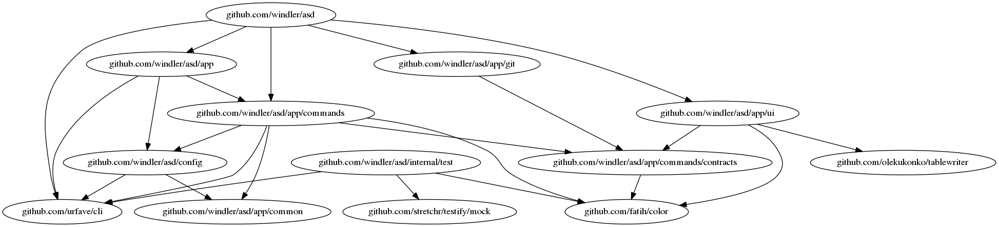
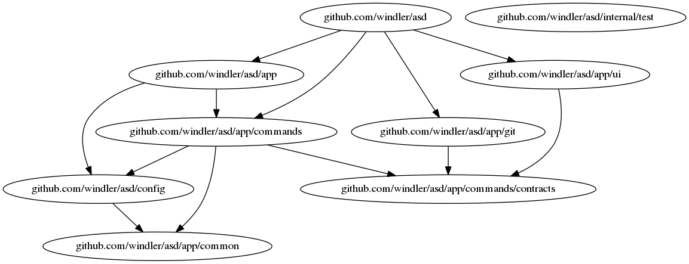
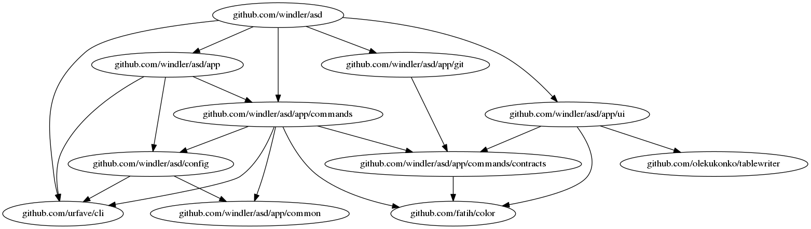
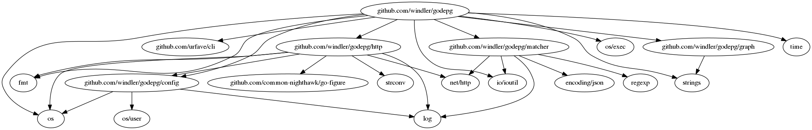

# godepg
`godepg` generates a dependency graph for a go package using `graphviz`.

1. [Prerequisites](#prerequisites)
2. [Installation](#installation)
3. [Usage](#usage)
4. [Generate graphs](#generate-graph)
5. [Examples](#examples)
6. [Print dependencies](#print-dependencies)
7. [Future work](#future-work)

## Prerequisites
In order to generate graphs you have to install [graphviz](https://graphviz.gitlab.io/)
## Installation
`go get github.com/windler/godepg`

## Usage
Simplest way to use the tool is to type `godepg -p <package> -o <file.png>`. There are some options available which you can list via `godepg -h`:

```(bash)
GLOBAL OPTIONS:
   -o file, --output file         destination file to write png to
   -p package, --package package  the package to analyze
   -n, --no-go-packages           hide gos buildin packages
   -d value, --depth value        limit the depth of the graph (default: -1)
   -f value, --filter value       filter package name
   -m, --my-packages-only         show only subpackages of scanned package
   --help, -h                     show help
   --version, -v                  print the version
```

## Generate graphs
All graphs are written to `~/godepg/<pkg>_timestamp.png` if option `-o` is not present. You can change the home directory by setting the env `GODEPG_HOME`.
There is also a small build in webserver you can launch to browse the generated graphs in browser. Launch it with command `ws`:
```(bash)
godepg ws
Started webserver on port 8000...
http://localhost:8000
```

## Examples
Following you can find sample outputs of the [asd package](https://github.com/windler/asd).

### Without go internal packages and specific output file
```(bash)
godepg -p github.com/windler/asd -o ~/asd_package.png --no-go-packages
```


### Only sub packages
```(bash)
godepg -p github.com/windler/asd --my-packages-only
```


### Without go internal packages and custom filter
```(bash)
godepg -p github.com/windler/asd --no-go-packages -f internal/test
```


### Other package
```(bash)
godepg -p github.com/windler/godepg
```


## Print dependencies
You can also just print information about the dependencies of a package by using option `-i`:
```(bash)
godepg -p github.com/windler/asd -i github.com/windler/asd/config
There are 8 dependencies for package github.com/windler/asd/config:

0: github.com/urfave/cli
1: github.com/windler/asd/app/common
2: gopkg.in/yaml.v2
3: io/ioutil
4: log
5: os
6: os/user
7: sync
```

### Get Dependents

If you would like to see a list of packages that depend on a specific package, just add the `--inverse` option:
```(bash)
godepg -p github.com/windler/asd -i github.com/windler/asd/config --inverse
There are 2 dependents for package github.com/windler/asd/config:

0: github.com/windler/asd/app/commands
1: github.com/windler/asd/app
```

### Modify output
You can modify the output by passing a (`template`)[https://golang.org/pkg/html/template/] using `--format`: 
```(bash)
godepg -p github.com/windler/asd -i github.com/windler/asd --format "Deps: {{.Count}}"
Deps: 5
```

You can use the following fields:
| Field          | Description                                        |
|----------------|----------------------------------------------------|
| Package        | The name of the scanned package                    |
| Count          | Number of found dependencies                       |
| Dependencies   | Array of packages                                  |
| DependencyType | Type of the dependencies (dependency or dependent) |

# Future work
- recognize and render isolated subgraphs
- render dependencies of go-file 

