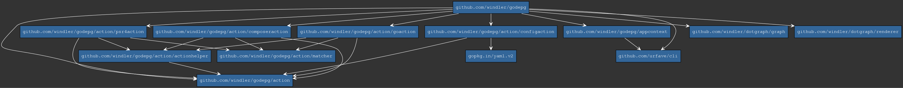
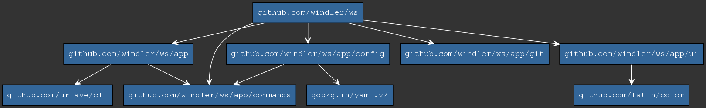
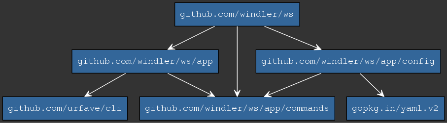
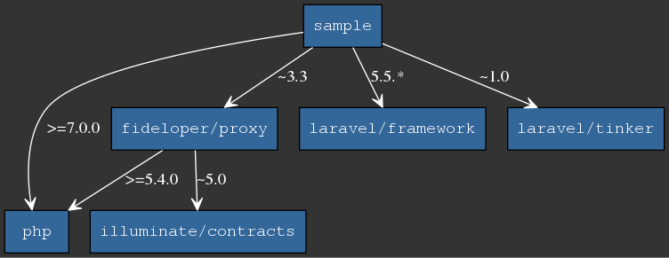

# godepg
`godepg` generates a dependency graph for a go or php project using `graphviz`. A dependency graph generated by `godepg` using a [config](godepg.yml) looks like the following:


Currently, the following technologies are supported:
* go
* php (composer)
* php (psr4)

## TOC

1. [Prerequisites](#prerequisites)
2. [Installation](#installation)
3. [Usage](#usage)
4. [Generate graphs](#generate-graph)
5. [Examples](#examples)
6. [Print dependencies](#print-dependencies)

## Prerequisites
In order to generate graphs you have to install [graphviz](https://graphviz.gitlab.io/)
## Installation
```bash
go get github.com/windler/godepg
``` 

Make sure that your `$GOROOT` is set and is present in your path
```bash
export PATH=$PATH:$GOROOT/bin
```

## Usage
For each language there is a subcommand. Type `godepg <language> -h` to see a list of available options.

### GO
```bash
godepg go -h
```

```bash
OPTIONS:
   -o file, --output file         destination file to write png to
   -p package, --package package  the package to analyze
   -n, --no-go-packages           hide gos buildin packages
   -d value, --depth value        limit the depth of the graph (default: -1)
   -f value, --filter value       filter package name
   -m, --my-packages-only         show only subpackages of scanned package
   -i package, --info package     shows the dependencies for a package
   --inverse                      shows all packages that depend on the package rather than its dependencies
   --format value                 formats the dependencies output (--info)
```

### PHP (composer)
```bash
godepg php-composer -h
```

```bash
OPTIONS:
   -o file, --output file         destination file to write png to
   -p project, --project project  the project to analyze
   -f value, --filter value       filter project name
   -s value, --stop-at value      dont scan dependencies of package name (pattern)
   -d value, --depth value        limit the depth of the graph (default: -1)
```

### PHP (psr4)
```bash
godepg php-psr4 -h
```

```bash
OPTIONS:
   -o file     destination file to write png to
   -p project  the project to analyze
   -f value    filter project name
   -s value    dont scan dependencies of package name (pattern)
   -d value    limit the depth of the graph (default: -1)
   -e value    exclude folder
```

## Generate graphs
All graphs are written to `~/godepg/<pkg>_timestamp.png` if option `-o` is not present. You can change the home directory by setting the env `GODEPG_HOME`.

### Generate Graphs using yaml file
When no language subcommand is specified, `godepg` will try to read a config file named `godepg.yml` to generate a dependy graph. You can also specify the config file with the option `--file`. Following, there is a sample config file:

```yaml
language: php-composer
output: /home/windler/projects/sample/deps.png
stopat:
- laravel
filter:
- php
- tinker
depth: 3
```

### Styling graphs using config
If you are using a config file you can also apply any [dot attributes](https://graphviz.gitlab.io/_pages/doc/info/attrs.html) to style your graph. Example:
```yaml
language: php-composer
output: /home/windler/projects/sample/deps.png
filter:
- php
depth: 3
edgestylepattern:
  "":
    arrowhead: open
    color: white
    fontcolor: white
    splines: curved
  sample:
    arrowhead: vee
    fontname: Courier
    style: dashed
nodestyle:
  fillcolor: "#336699" 
  style: filled
  fontcolor: white
  fontname: Courier
  shape: rectangle
graphstyle:
  bgcolor: "#333333"
```

After creating a config file, you can always update your current dependy graph using
```bash
cd /home/windler/projects/sample
godepg 
```
or
```bash
godepg --file /home/windler/projects/sample/godepg.yml
```

### Available attributes

| Attribute | Type | Language | Description |
|--|--|--|--|
| language | string | all | the language to use |
|	filter | array | all | filters node names (hide) |
| depth | int | all | max depth of the graph |
| output | string | all | output file of the png (and dot file) |
|	edgestylepattern | map string -> (map string -> string) | all | apply dot attributes to edges. The first map key is a pattern on which nodes the attributes should be applied. If all nodes should be applied use `""`. |
|	edgestyle | map string -> string | all | apply edge attributes |
|	nodestyle | map string -> string | all | apply node attributes |
|	graphstyle | map string -> string | all | apply graph attributes |
|	project | string | php | the project the use (relative to wd) |
|	exclude | array | php | folders to ignore |
|	stopat | array | php | print node but dont scan/print dependencies |
|	package | string | go | package name to scan |
|	nogopackages | bool | go | hide go packges in graph |
| mypackagesonly | bool | go | only show subpackages of the scanned package |

## Examples
Following, you can find sample outputs.

### GO
Samples for the [ws package](https://github.com/windler/ws) package.

#### Without go internal packages and specific output file
```bash
godepg go -p github.com/windler/ws -o ~/ws_package.png -n
```
or

```bash
cd /user/windler/go/src/github.com/windler/ws
godepg go -p . -o ~/ws_package.png -n
```


#### Only sub packages
```bash
godepg go -p github.com/windler/ws -m
```


#### Without go internal packages and custom filter
```bash
godepg go -p github.com/windler/ws -n -f=ui -f=/git
```


### PHP
Samples for a fresh [Laravel](https://github.com/laravel/laravel) installation called `sample`.

#### Dont show laravels dependencies
```(bash)
godepg php-composer -p /home/windler/projects/sample -s=laravel
```


#### Hide symfony dependecies
```(bash)
godepg php-composer -p /home/windler/projects/sample -f=symfony
```


## Print dependencies (GO only)
You can also just print information about the dependencies of a package by using option `-i`:
```(bash)
godepg go -p github.com/windler/ws -i github.com/windler/ws/app/config
There are 7 dependencies for package github.com/windler/ws/app/config:

0: github.com/windler/ws/app/commands
1: gopkg.in/yaml.v2
2: io/ioutil
3: log
4: os
5: os/user
6: strings
```

### Get Dependents

If you would like to see a list of packages that depend on a specific package, just add the `--inverse` option:
```(bash)
godepg go -p github.com/windler/ws -i github.com/windler/ws/app/config --inverse
There are 1 dependents for package github.com/windler/ws/app/config:

0: github.com/windler/ws
```

### Modify output
You can modify the output by passing a [`template`](https://golang.org/pkg/html/template/) using `--format`: 
```(bash)
godepg go -p github.com/windler/ws -i github.com/windler/ws --format "Deps: {{.Count}}"
Deps: 5
```

You can use the following fields:

| Field          | Description                                        |
|----------------|----------------------------------------------------|
| Package        | The name of the scanned package                    |
| Count          | Number of found dependencies                       |
| Dependencies   | Array of packages                                  |
| DependencyType | Type of the dependencies (dependency or dependent) |
